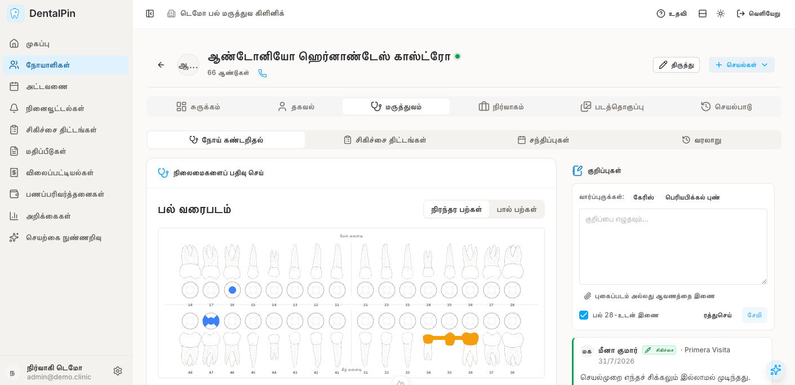
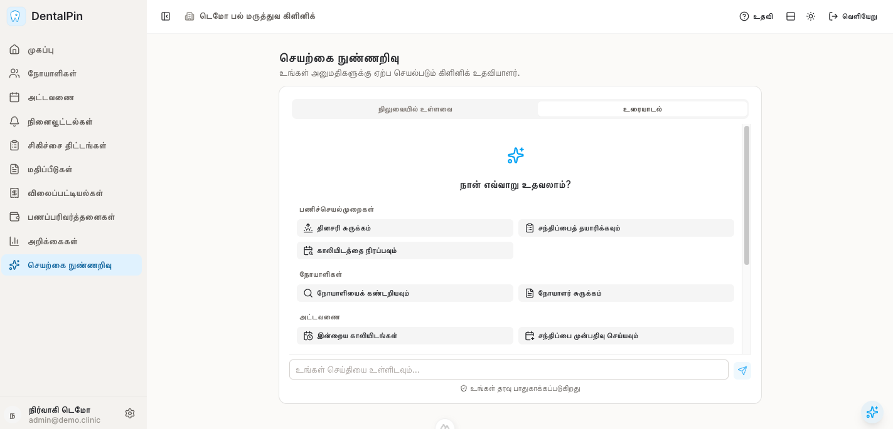
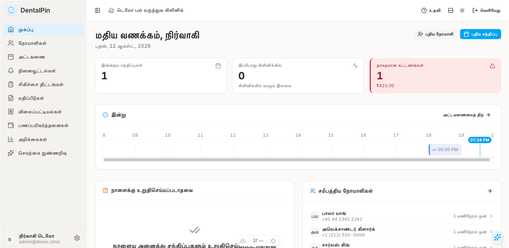
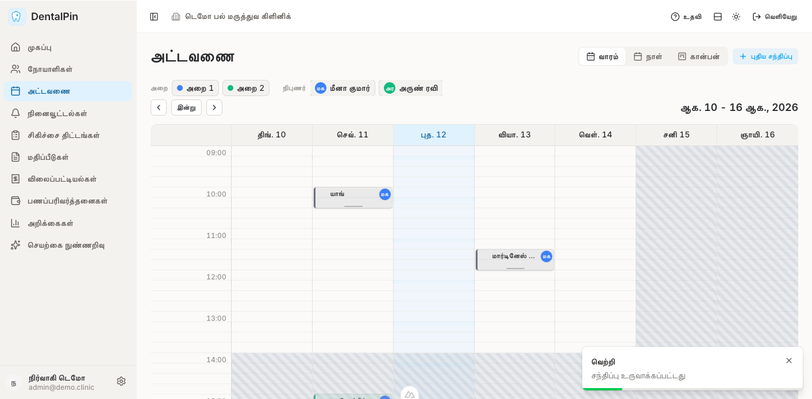
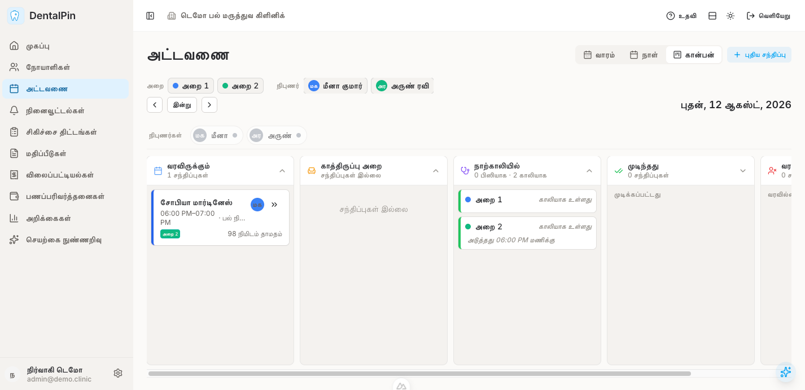
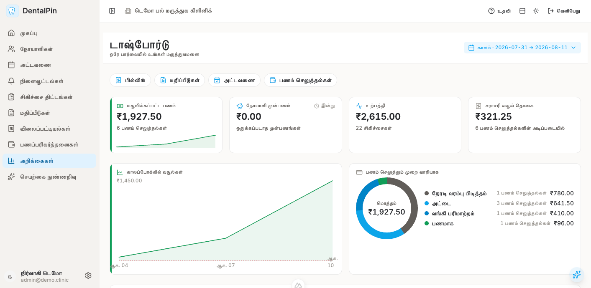
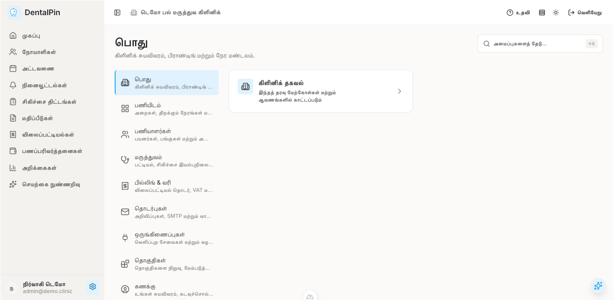

# DentalPin

[](./README.md)
[](./README.es.md)
[](./README.fr.md)
[](./README.ta.md)

**திறந்த மூல பல் மருத்துவமனை மேலாண்மை மென்பொருள்.** நோயாளிகள், பல் வரைபடம் (odontogram),
அட்டவணை, சிகிச்சை திட்டங்கள், பில்லிங் மற்றும் உள்ளமைக்கப்பட்ட AI கோபைலட் — மட்டு அடிப்படையிலான,
சுய-ஹோஸ்ட் செய்யக்கூடிய, API-முதன்மையான அமைப்பு.

### ▶ [**நேரடி டெமோவை முயற்சிக்கவும்**](https://demo.dentalpin.com)

`admin@demo.clinic` / `demo1234` மூலம் உள்நுழையவும் — முன்பே தயார் செய்யப்பட்ட ஒரு கிளினிக்கிற்கான
முழு நிர்வாக அணுகல். ஒவ்வொரு இரவும் மீட்டமைக்கப்படும், எனவே எதை வேண்டுமானாலும் சோதித்துப் பாருங்கள்.

[](https://demo.dentalpin.com)

<sub>[இணையதளம்](https://www.dentalpin.com) · [ஆவணங்கள்](https://docs.dentalpin.com) · [Telegram](https://t.me/dentalpin) · [மேலும் ஸ்கிரீன்ஷாட்கள் ↓](#ஸ்கிரீன்ஷாட்கள்)</sub>

## ஏன் DentalPin?

உலகெங்கிலும் உள்ள பல் மருத்துவமனைகள் ஒரே அடிப்படைத் தேவைகளைப் பகிர்ந்து கொள்கின்றன: நோயாளிகளை நிர்வகித்தல், சந்திப்புகளை திட்டமிடுதல், சிகிச்சைகளைக் கண்காணித்தல், மற்றும் தங்கள் நடைமுறையை திறமையாக இயக்குதல். இருப்பினும், மென்பொருள் உலகம் விலையுயர்ந்த ஒப்பந்தங்களிலும் காலாவதியான தொழில்நுட்பத்திலும் கிளினிக்குகளை பூட்டிவைக்கும், பல்வேறு உள்ளூர்மயமாக்கப்பட்ட, மூடிய-மூல தீர்வுகளாக துண்டு துண்டாக உள்ளது.

**மாற்றத்திற்கான நேரம் இது என்று நாங்கள் நம்புகிறோம்.**

DentalPin ஒரு எளிய கொள்கையின் அடிப்படையில் கட்டமைக்கப்பட்டுள்ளது: **எங்கும் உள்ள பல் மருத்துவமனைகளுக்கான ஒரே திறந்த தளம்**. மற்றொரு பிராந்திய தீர்வு அல்ல, மாறாக எந்த கிளினிக்கும் ஏற்றுக்கொள்ளக்கூடிய, எந்த டெவலப்பரும் விரிவாக்கக்கூடிய, எந்த சமூகமும் உள்ளூர்மயமாக்கக்கூடிய ஒரு உலகளாவிய அடித்தளம்.

### ஏன் இப்போது?

சிறிய குழுக்கள் என்ன உருவாக்க முடியும் என்பதை AI அடிப்படையில் மாற்றியுள்ளது. முன்பு பெரிய மேம்பாட்டுத் துறைகள் தேவைப்பட்ட அம்சங்களை இப்போது சில நாட்களில் செயல்படுத்த முடியும். கிளினிக்குகள் தப்பிக்க முடியாத பழைய அமைப்புகளில் சிக்கிக்கொள்வதற்கு முன்பே — பல ஆண்டுகளுக்கு முன்பே இருந்திருக்க வேண்டிய திறந்த மூல பல் மருத்துவ மென்பொருளை உருவாக்குவதற்கான எங்கள் வாய்ப்பு இதுவே.

### எங்கள் கொள்கைகள்

- **திறந்த மூலம்** — உங்கள் கிளினிக் தரவு உங்களுக்குச் சொந்தமானது. உங்கள் மென்பொருளும் அப்படியே இருக்க வேண்டும்.
- **மட்டு அடிப்படையிலானது** — எளிமையாகத் தொடங்குங்கள், தேவையானதைச் சேர்க்கவும். ஒருபோதும் பயன்படுத்தாத அம்சங்களுக்குக் கட்டணம் செலுத்த வேண்டாம்.
- **வடிவமைப்பிலேயே உலகளாவியது** — முதல் நாளிலிருந்தே உள்ளூர்மயமாக்கலுக்காக கட்டமைக்கப்பட்டது. ஒரே மையம், எந்த மொழியும், எந்த நாடும்.
- **API-முதன்மை** — ஒவ்வொரு அம்சமும் ஒரு API. எதுவுடனும் ஒருங்கிணைக்கவும், எல்லாவற்றையும் தானியங்குபடுத்தவும்.
- **AI-தயார்** — AI யுகத்திற்கு ஏற்றவாறு கட்டமைக்கப்பட்டது. புத்திசாலித்தனமான அட்டவணையிடல், மருத்துவ முடிவு ஆதரவு, மற்றும் பணிப்பாய்வு தானியங்குமயமாக்கலுக்குத் தயார்.

### எங்கள் தொலைநோக்கு

நாங்கள் வெறும் மென்பொருளை மட்டும் உருவாக்கவில்லை — ஒரு சூழ்நிலை அமைப்பின் அடித்தளத்தை உருவாக்குகிறோம். டெவலப்பர்கள் மட்டுகளை பங்களிக்கும், கிளினிக்குகள் மேம்பாடுகளைப் பகிரும், மற்றும் முழு பல் மருத்துவ சமூகமும் கூட்டு புதுமையிலிருந்து பயனடையும் ஒரு தளம்.

கிளினிக்குகள் கடந்த தசாப்தத்தின் மூடிய, விலையுயர்ந்த மென்பொருளை விட சிறந்ததற்கு தகுதியானவை. DentalPin என்பது திறந்த மாற்று.

## ✨ AI கோபைலட்

DentalPin ஒரு உள்ளமைக்கப்பட்ட **ஏஜென்டிக் AI உதவியாளருடன்** வருகிறது, இது முழு கிளினிக்கையும் நீங்கள் வெறுமனே பேசக்கூடிய ஒன்றாக மாற்றுகிறது. ஒரு நோயாளியைக் கண்டுபிடிக்கச் சொல்லுங்கள், ஒரு நேரத்தை காலியாக்குங்கள், பதிலளிக்கப்படாத மதிப்பீட்டைப் பின்தொடருங்கள், அல்லது வரும் நாளைப் பற்றி உங்களுக்கு சுருக்கம் தாருங்கள் — தமிழில் அல்லது ஆங்கிலத்தில் — அது உங்கள் உண்மையான தரவின் அடிப்படையில் செயல்படும்.



இது மேலோட்டமாக ஒட்டப்பட்ட ஒரு chatbot அல்ல. கோபைலட் ஒரு உண்மையான ஏஜென்ட், இது UI செய்யும் அதே செயல்பாடுகளை அழைத்து, நோயாளிகள், அட்டவணை, நினைவூட்டல்கள், மதிப்பீடுகள், கட்டணங்கள் மற்றும் அறிக்கைகள் முழுவதும் **பல-படி பணிகளைத் திட்டமிட்டு செயல்படுத்துகிறது**.

- **அது செய்கிறது, பதில் மட்டும் தராது.** ஏஜென்ட் உண்மையான கருவிகளை இயக்குகிறது — நோயாளிகளைத் தேடுதல், சந்திப்புகளை பதிவு செய்தல் அல்லது மறுசீரமைத்தல், ஒரு கட்டணத்தைப் பதிவு செய்தல், இந்த மாதத்தின் வசூல்களை எடுத்தல் — மற்றும் ஒரு பணியை முழுமையாக நிறைவேற்ற அவற்றை இணைக்கிறது.
- **இது உங்கள் பங்கை ஒருபோதும் மீறாது.** ஒவ்வொரு கருவி அழைப்பும் செயல்படுத்தும் தடுப்பு புள்ளியில் அழைக்கும் பயனரின் RBAC அனுமதிகளுக்கு எதிராக மீண்டும் சரிபார்க்கப்படுகிறது. கோபைலட் அந்த பயனர் UI மூலம் செய்யக்கூடியதை *சரியாக* பார்க்கவும் செய்யவும் முடியும் — அதற்கு மேல் ஒன்றும் இல்லை, அவர்களின் கிளினிக்கிற்கு மட்டுப்படுத்தப்பட்டது.
- **உங்கள் தரவு பாதுகாக்கப்படுகிறது.** LLM வழங்குநருக்கு எதுவும் அனுப்பப்படுவதற்கு முன்பே PHI (நோயாளி அடையாள தரவு) நீக்கப்படுகிறது: நோயாளி பெயர்கள், தொலைபேசி எண்கள், மின்னஞ்சல்கள் மற்றும் அடையாள எண்கள் நிர்ணயிக்கப்பட்ட டோக்கன்களால் மாற்றப்படுகின்றன, மற்றும் இலவச-உரை மருத்துவக் கருவிகள் கிளவுட் பாதையிலிருந்து முற்றிலும் விலக்கப்படுகின்றன. நீக்குதல் இயல்பாகவே இயக்கத்தில் உள்ளது.
- **எழுத்துகள் முதலில் கேட்கின்றன.** தரவை மாற்றும் எந்த செயலும் (பதிவு, கட்டணங்கள், திருத்தங்கள்) இயங்குவதற்கு முன் உங்கள் வெளிப்படையான உறுதிப்படுத்தலுக்காக உரையாடலின் நடுவில் இடைநிறுத்தப்படும்.
- **வழிகாட்டப்பட்ட பணிப்பாய்வுகள்.** தயார் நிலையிலான playbooks — *தினசரி சுருக்கம்*, *ஒரு வருகையைத் தயார் செய்தல்*, *ஒரு இடைவெளியை நிரப்புதல்*, *நிலுவையிலுள்ள நினைவூட்டல்கள்*, *பதிலளிக்கப்படாத மதிப்பீடுகள்* — பொதுவான பல-படி பணிகளை ஒரே தட்டில் தொடங்கும்.
- **முன்கூட்டிய சுருக்கங்கள்.** உங்கள் குழுவிற்கு மின்னஞ்சல் செய்யப்படும் ஒரு நிர்ணயிக்கப்பட்ட காலை டைஜெஸ்ட்டைத் தேர்வு செய்யவும், அன்றைய அட்டவணை, நிலுவையிலுள்ள நினைவூட்டல்கள் மற்றும் திறந்த மதிப்பீடுகளைச் சுருக்கமாகக் கூறும் — LLM இல்லை, தளத்திற்கு வெளியே PHI இல்லை.
- **வடிவமைப்பிலேயே மட்டு அடிப்படையிலானது.** ஒரு பகிரப்பட்ட பதிவேட்டின் மூலம் ஒவ்வொரு மட்டும் வெளியிடும் கருவிகளை கோபைலட் பயன்படுத்துகிறது; ஒவ்வொரு மட்டும் அதன் சொந்த திறன்களை பங்களிக்கிறது, எனவே புதிய மட்டுகள் நிறுவப்படும்போது ஏஜென்ட் தானாகவே வளர்கிறது.

உட்கட்டமைப்பில் வழங்குநர்-சாராதது (LLM-வழங்குநர் சுருக்கம்), வழங்குநர், மாடல், மற்றும் கிளினிக் ஒன்றுக்கான டோக்கன் பட்ஜெட்டுகள் ஒவ்வொரு டிப்ளாய்மென்ட்டிற்கும் உள்ளமைக்கக்கூடியவை. கட்டமைப்பு: [docs/technical/copilot-agentic-architecture.md](docs/technical/copilot-agentic-architecture.md).

## இணையதளம்

தயாரிப்பு தகவல், அம்சங்கள் மற்றும் வணிக விவரங்களுக்கு [**dentalpin.com**](https://www.dentalpin.com) ஐப் பார்வையிடவும்.

## சமூகம்

ஆதரவு, நிறுவல் உதவி மற்றும் கேள்விகளுக்கு எங்கள் [**Telegram சேனலில்**](https://t.me/dentalpin) இணையவும்.

## ஸ்கிரீன்ஷாட்கள்

### டாஷ்போர்டு


### நோயாளி மேலாண்மை


### வாராந்திர அட்டவணை


### கான்பன் அட்டவணை


### கட்டண விவரப்படம்


### அமைப்புகள்


## விரைவு தொடக்கம்

```bash
# சேவைகளைத் தொடங்கவும்
docker-compose up -d

# டெமோ தரவை விதைக்கவும் (இயல்பாக ஆங்கிலம்)
./scripts/seed-demo.sh

# அல்லது ஸ்பானிஷில்
./scripts/seed-demo.sh --lang es

# அல்லது பிரெஞ்சில்
./scripts/seed-demo.sh --lang fr

# அல்லது தமிழில்
./scripts/seed-demo.sh --lang ta
```

http://localhost:3000 ஐத் திறக்கவும்

### டெமோ உள்நுழைவு விவரங்கள்

அனைத்து பயனர்களுக்கும் கடவுச்சொல்: `demo1234`

| மின்னஞ்சல் | பங்கு | பெயர் (EN) | பெயர் (ES) | பெயர் (FR) | பெயர் (TA) |
|-------|-----|-------------|-------------|-------------|-------------|
| admin@demo.clinic | admin | Admin Demo | Admin Demo | Admin Demo | Admin Demo |
| dentist@demo.clinic | dentist | Dr. Sarah Johnson | Dra. María García López | Dr. Marie Dubois | டாக்டர் கவிதா ராமச்சந்திரன் |
| hygienist@demo.clinic | hygienist | Michael Williams | Carlos López Martínez | Thomas Moreau | கார்த்திகேயன் வேலுசாமி |
| assistant@demo.clinic | assistant | Emily Davis | Ana Martínez Ruiz | Camille Petit | பிரியா செல்வக்குமார் |
| receptionist@demo.clinic | receptionist | Jessica Brown | Laura Sánchez Pérez | Julie Bernard | தீபிகா முருகேசன் |

டெமோ தரவு பற்றிய முழு விவரங்களுக்கு [docs/user-manual/demo.md](docs/user-manual/demo.md) ஐப் பார்க்கவும்.

## தொழில்நுட்ப அடுக்கு

| அடுக்கு | தொழில்நுட்பம் |
|------|-----------|
| Backend | FastAPI (Python 3.11+) |
| Frontend | Nuxt 3 + Nuxt UI |
| தரவுத்தளம் | PostgreSQL 15 |
| அங்கீகாரம் | Refresh டோக்கன்களுடன் JWT |

## அம்சங்கள்

### AI கோபைலட்
- **ஏஜென்டிக் உதவியாளர்** — நோயாளிகள், அட்டவணை, நினைவூட்டல்கள், மதிப்பீடுகள், கட்டணங்கள் மற்றும் அறிக்கைகள் முழுவதும் உண்மையான செயல்பாடுகளை அழைத்து பல-படி பணிகளைத் திட்டமிட்டு செயல்படுத்தும் உரையாடல் ஏஜென்ட்
- **RBAC சமநிலை** — ஒவ்வொரு செயலும் பயனரின் அனுமதிகளுக்கு எதிராக மீண்டும் சரிபார்க்கப்படுகிறது; ஏஜென்ட் அந்த பயனர் UI மூலம் செய்யக்கூடியதை மட்டுமே செய்ய முடியும், அவர்களின் கிளினிக்கிற்கு மட்டுப்படுத்தப்பட்டது
- **PHI நீக்குதல்** — நோயாளி அடையாளங்கள் LLM ஐ அடைவதற்கு முன் டோக்கனாக்கப்படுகின்றன; இலவச-உரை மருத்துவத் தரவு கிளவுட் பாதைக்கு வெளியே இருக்கும். இயல்பாகவே இயக்கத்தில் உள்ளது
- **உறுதிப்படுத்தப்பட்ட எழுத்துகள்** — தரவை மாற்றும் செயல்கள் உரையாடலின் நடுவில் பயனரின் வெளிப்படையான உறுதிப்படுத்தலுக்காக இடைநிறுத்தப்படும்
- **பணிப்பாய்வுகள் & டைஜெஸ்ட்** — ஒரே-தட்டு playbooks (தினசரி சுருக்கம், ஒரு வருகையைத் தயார் செய்தல், ஒரு இடைவெளியை நிரப்புதல்) மற்றும் ஒரு விருப்ப முன்கூட்டிய காலை மின்னஞ்சல் டைஜெஸ்ட்
- **பன்மொழி & வழங்குநர்-சாராதது** — தமிழ், பிரெஞ்சு, ஸ்பானிஷ் மற்றும் ஆங்கிலத்தில் செயல்படுகிறது; உள்ளமைக்கக்கூடிய LLM வழங்குநர், மாடல், மற்றும் கிளினிக் ஒன்றுக்கான டோக்கன் பட்ஜெட்

### மருத்துவ மேலாண்மை
- **நோயாளி பதிவுகள்** — தனிப்பட்ட தரவு, தொடர்பு தகவல், மருத்துவ வரலாறு மற்றும் குறிப்புகளுடன் கூடிய முழுமையான நோயாளி சுயவிவரங்கள்
- **பல் வரைபடம் (Odontogram)** — பல்/மேற்பரப்பு அடிப்படையில் சிகிச்சை கண்காணிப்புடன் கூடிய ஊடாடும் பல் வரைபடம்
- **சந்திப்பு காலண்டர்** — இழுத்து-விடும் வசதி, நிபுணர் நெடுவரிசைகள், முரண்பாடு கண்டறிதலுடன் கூடிய வாராந்திர மற்றும் தினசரி காட்சிகள்
- **சிகிச்சை பட்டியல்** — குறியீடுகள், விலைகள், VAT வகைகள் மற்றும் வகைப்பாடுகளுடன் தனிப்பயனாக்கக்கூடிய பட்டியல்

### நிதி மேலாண்மை
- **மதிப்பீடுகள்** — சிகிச்சை மதிப்பீடுகளை உருவாக்குதல், ஒப்புதல் பணிப்பாய்வைக் கண்காணித்தல் (வரைவு → நிலுவையில் → அங்கீகரிக்கப்பட்டது/நிராகரிக்கப்பட்டது), நோயாளி கையொப்பம் பதிவு, PDF உருவாக்கம்
- **விலைப்பட்டியல்கள்** — மதிப்பீடுகளிலிருந்து அல்லது தனித்தனியாக விலைப்பட்டியல்களை உருவாக்குதல், தானியங்கு எண்ணிடல், பல கட்டண முறைகள், PDF ஏற்றுமதி
- **கட்டணங்கள்** — பகுதி கட்டணங்களைக் கண்காணித்தல், கட்டண வரலாறு, மீதி கணக்கீடு

### கிளினிக் நிர்வாகம்
- **பங்கு அடிப்படையிலான அணுகல் கட்டுப்பாடு** — நுணுக்கமான அனுமதிகளுடன் ஐந்து பங்குகள் (admin, dentist, hygienist, assistant, receptionist)
- **அறை மேலாண்மை** — அட்டவணைகள் மற்றும் நிறங்களுடன் சிகிச்சை அறைகளை வரையறுத்தல்
- **நிபுணர் மேலாண்மை** — குறிப்பிட்ட பல் மருத்துவர்கள்/சுத்தம் செய்பவர்களுக்கு சந்திப்புகளை ஒதுக்கீடு செய்தல்

### பயனர் அனுபவம்
- **காட்சி தேர்வாளர்கள்** — சமீபத்திய நோயாளிகள் மற்றும் பிரபலமான சிகிச்சைகளைக் காட்டும் புத்திசாலித்தனமான dropdowns
- **பன்மொழி இடைமுகம்** — தமிழ், பிரெஞ்சு, ஸ்பானிஷ் மற்றும் ஆங்கிலத்தில் முழுமையான உள்ளூர்மயமாக்கல்
- **இருண்ட பயன்முறை** — கணினியை அறிந்த தீம் மாற்றம்
- **பதிலளிக்கக்கூடிய வடிவமைப்பு** — டெஸ்க்டாப் மற்றும் டேப்லெட்டில் வேலை செய்யும்

### தொழில்நுட்ப அம்சங்கள்
- **மட்டு கட்டமைப்பு** — எளிதான விரிவாக்கத்திற்கான பிளக்-இன் அடிப்படையிலான அமைப்பு
- **நிகழ்வு பஸ்** — அறிவிப்புகள் மற்றும் ஒருங்கிணைப்புகளுக்கான மட்டுகளுக்கிடையேயான தொடர்பு
- **REST API** — OpenAPI ஆவணங்களுடன் கூடிய முழுமையான API
- **நேரடி புதுப்பிப்புகள்** — மகிழ்ச்சிகரமான புதுப்பிப்புகளுடன் கூடிய தீவிர இடைமுகம்

## மேம்பாடு

### தேவையான முன்நிபந்தனைகள்

- Docker மற்றும் Docker Compose
- Python 3.11+ (உள்ளூர் backend மேம்பாட்டிற்கு)
- Node.js 18+ (உள்ளூர் frontend மேம்பாட்டிற்கு)

### உள்ளூரில் இயக்குதல்

```bash
# அனைத்து சேவைகளையும் தொடங்கவும்
docker-compose up

# அல்லது backend ஐ தனியாக இயக்கவும்
cd backend
pip install -e ".[dev]"
uvicorn app.main:app --reload

# அல்லது frontend ஐ தனியாக இயக்கவும்
cd frontend
npm install
npm run dev
```

### தரவுத்தள மேலாண்மை

```bash
# தரவுத்தளத்தை மீட்டமைத்து மைக்ரேஷன்களை இயக்கவும்
./scripts/reset-db.sh

# டெமோ தரவை விதைக்கவும் (ஆங்கிலம் - இயல்பு)
./scripts/seed-demo.sh

# டெமோ தரவை விதைக்கவும் (ஸ்பானிஷ்)
./scripts/seed-demo.sh --lang es

# டெமோ தரவை விதைக்கவும் (பிரெஞ்சு)
./scripts/seed-demo.sh --lang fr

# டெமோ தரவை விதைக்கவும் (தமிழ்)
./scripts/seed-demo.sh --lang ta

# முழு அமைப்பு (மீட்டமைப்பு + விதைத்தல் ஒரே கட்டளையில்)
./scripts/setup-demo.sh
```

### சோதனைகளை இயக்குதல்

```bash
# Backend unit + integration (Docker இல்)
docker-compose exec backend python -m pytest -v

# மெதுவான Alembic round-trip (விருப்பம், docs/technical/creating-modules.md ஐப் பார்க்கவும்)
docker-compose exec backend python -m pytest -v -m alembic_roundtrip

# Frontend unit (vitest)
cd frontend
npm run test
```

**உலாவி E2E (Playwright)** `frontend/tests/e2e/` இல் உள்ளது மற்றும் `localhost:3000` → `:8000` இல்
முழு ஸ்டேக்கையும் இயக்குகிறது. Alpine frontend கன்டெய்னரால் Chromium ஐ இயக்க முடியாததால் இது
ஹோஸ்டில் இயங்குகிறது.

```bash
# ஒருமுறை அமைப்பு
(cd frontend && npm install && npx playwright install chromium)

# முதலில் ஸ்டேக் இயங்குவதையும் விதைக்கப்பட்டதையும் உறுதிசெய்யவும்
docker-compose up -d
./scripts/seed-demo.sh

# முழு E2E தொகுப்பு (nav + RBAC + நோயாளி விவர smoke test)
./scripts/e2e.sh

# ஒரு தனி கோப்பு
./scripts/e2e.sh rbac

# ஊடாடும் UI
./scripts/e2e.sh --ui
```

முழு runbook + fixture குறிப்பு: [docs/technical/e2e-testing.md](docs/technical/e2e-testing.md).

## கட்டமைப்பு

DentalPin ஒரு மட்டு பிளக்-இன் கட்டமைப்பைப் பயன்படுத்துகிறது. ஒவ்வொரு அம்சமும் ஒரு தன்னிறைவான மட்டு:
- அதன் SQLAlchemy மாடல்களை அறிவிக்கிறது
- ஒரு FastAPI router ஐ வழங்குகிறது
- மற்ற மட்டுகளின் நிகழ்வுகளுக்கு subscribe செய்யலாம்

விவரங்களுக்கு [docs/architecture.md](docs/architecture.md) ஐப் பார்க்கவும்.

## உரிமம்

Business Source License 1.1 (BSL 1.1)

**பயன்பாட்டு வரம்பு:** பல் மருத்துவமனை மேலாண்மைக்கான வணிக SaaS ஆக DentalPin ஐ வழங்கக்கூடாது.

**மாற்று தேதி:** வெளியீட்டிலிருந்து 4 ஆண்டுகள்

**மாற்று உரிமம்:** Apache 2.0

முழு விதிமுறைகளுக்கு [LICENSE](LICENSE) ஐப் பார்க்கவும்.

## பங்களிப்பு

வழிகாட்டுதல்களுக்கு [CONTRIBUTING.md](CONTRIBUTING.md) ஐப் பார்க்கவும்.

---

ஆதரவு: [Dentaltix](https://www.dentaltix.com)
